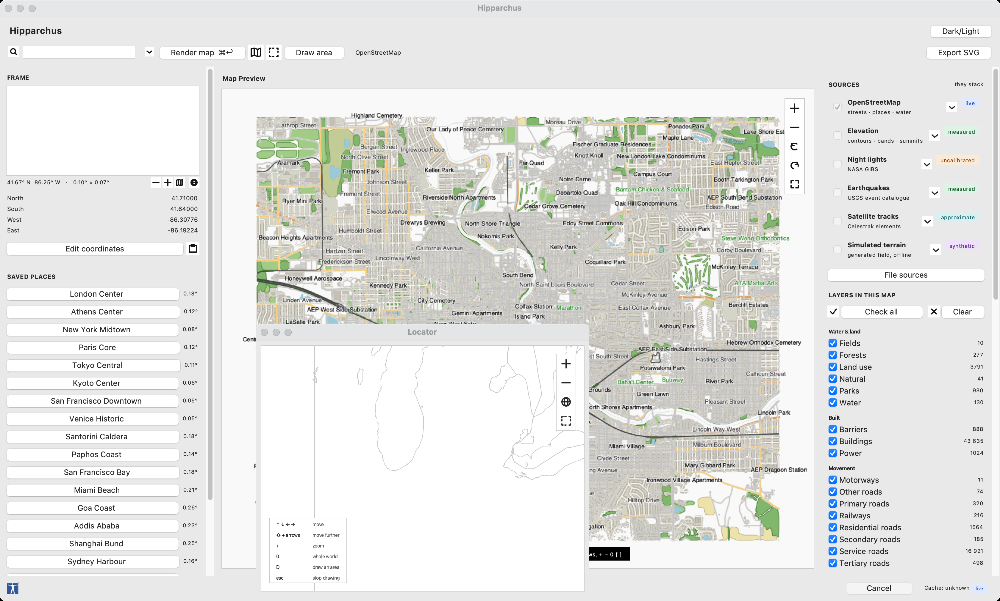
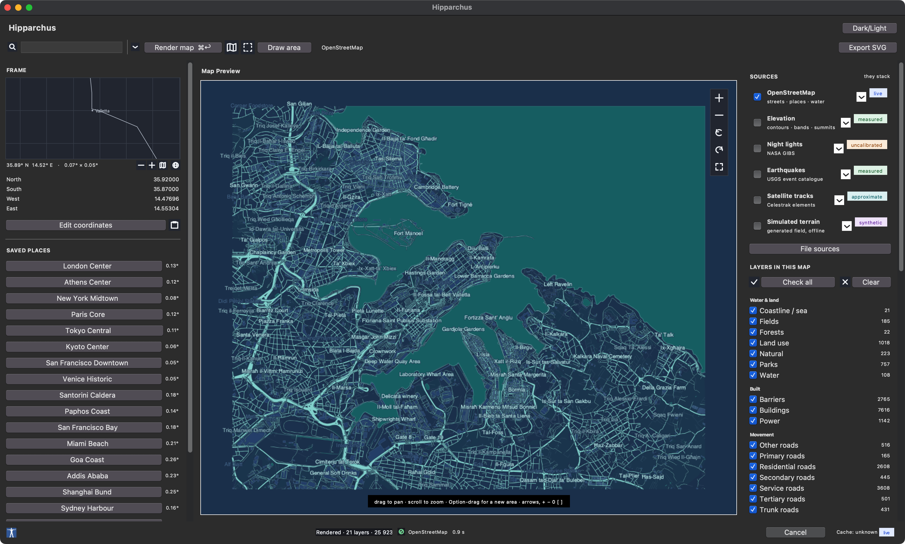
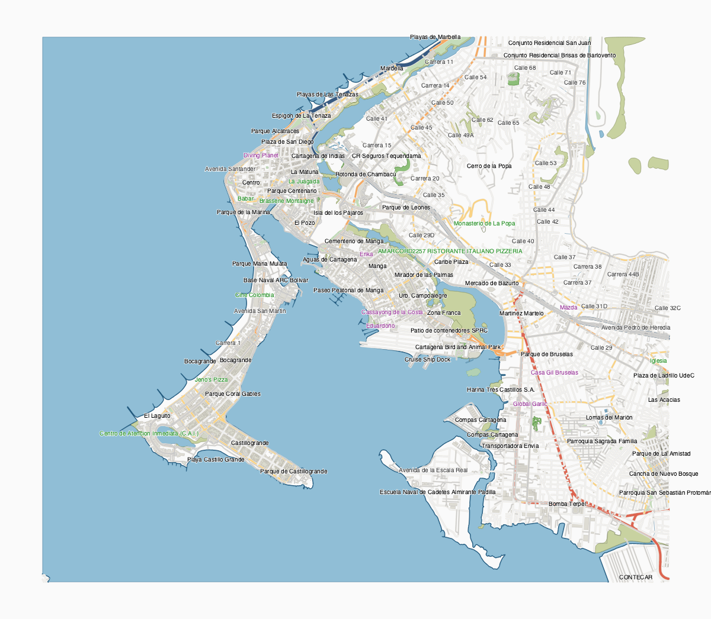
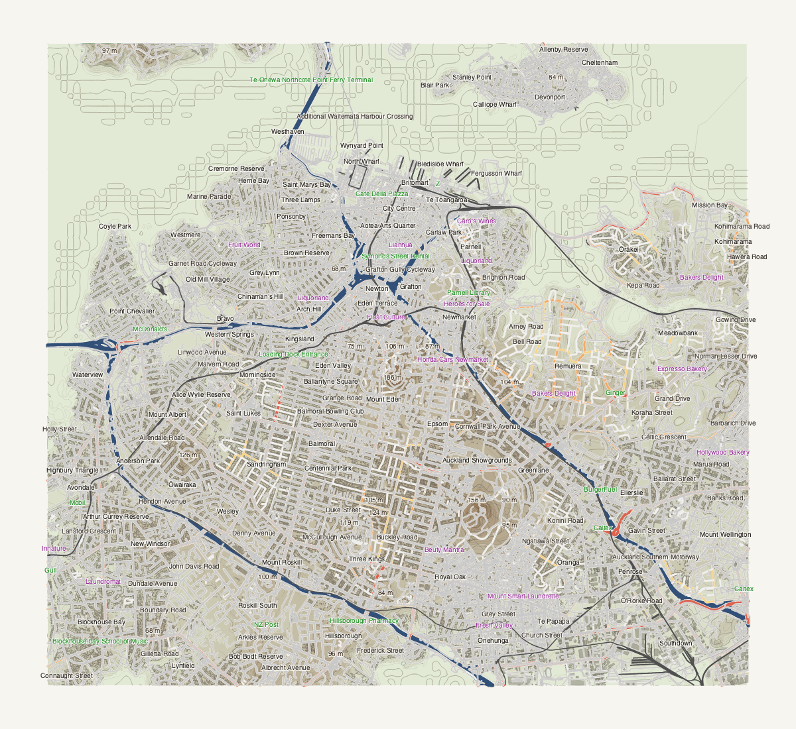

# Hipparchus

**Version 0.8.0**

**Hipparchus is an online desktop vector cartography app for creating clean, editable maps from OpenStreetMap data and exporting them as Illustrator-friendly SVG files.**

<table>
  <tr>
    <td width="50%"></td>
    <td width="50%"></td>
  </tr>
  <tr>
    <td align="center"><em>Santorini — real elevation, <code>Hypsometric Relief</code></em></td>
    <td align="center"><em>San Francisco — streets over real elevation</em></td>
  </tr>
</table>

## Introduction

Hipparchus is named after the ancient Greek astronomer, geographer, and cartographer Hipparchus of Nicaea. The app follows that spirit: it is built for people who want to explore geography visually, compose map layers, and produce clean vector artwork rather than browse raster map tiles.

The application fetches live OpenStreetMap data through the Overpass API, renders it in a Tkinter desktop interface, and exports layered SVG maps that can be opened in Adobe Illustrator, Inkscape, Affinity Designer, or other vector tools. It is intentionally focused: online map fetching, clean geometry, fast preview, and simple export.

Hipparchus is a standalone map creation tool focused on live online data, clean rendering, and editable vector export.

## Features

New in 0.8.0:

- **The world's countries among the saved places.** World, the six continents
  and the Mediterranean, and all ~195 countries grouped by continent, as a
  cascade in the Map menu and the rail. Country boxes are generated from Natural
  Earth, with curated mainland frames for the antimeridian spanners (Russia, the
  United States, Fiji, New Zealand, Kiribati).
- **Natural Earth as a download, not a checkout.** Sources → Natural Earth gains
  a Download button, and a one-time first-run offer, that fetches the 1:110m and
  1:10m layers the world sheets and the Locator read — no folder to hunt for.
- **A bundled multilingual default face.** Noto Sans ships with the app (Latin,
  Greek, Cyrillic; SIL Open Font License), the per-script fallback reaching the
  OS for the scripts it does not cover, so a Japanese or Arabic name still
  renders. The label face becomes a dropdown of every family the system reports.

New in 0.7.0 — the app could not usefully draw a country, a continent or the
world, and [A continent, or the whole world](#a-continent-or-the-whole-world)
is the whole of what that took:

- **Equal Earth**, reached for automatically when a frame has outgrown the flat projection it asked for. Equal area exactly, poles as lines, no frame size at which it stops working — and no projection picker, because the frame has already answered the question. Previews move with exports.
- **Natural Earth end to end**: a folder of shapefiles as one source, `--natural-earth` on the headless renderer, and the one missing translation that was silently dropping every place name on the sheet.
- **Samples across**, under Elevation: how finely to sample the ground, with the tile ceiling raised from 64 to 256 so a large frame is sampled as finely as it was asked to be rather than quietly halved. The README says what it costs and what it does not buy.
- **A size refusal the headless renderer honours.** A warning is a question and a question needs somebody to answer it; past a couple of thousand square kilometres Overpass does not answer at all, which is a statement. `scripts/render_gallery.py` consulted neither, and would wait out a timeout for a sheet that was never coming.

New in 0.6.0:

- **Sea surface temperature**, fetched from NASA JPL's MUR analysis through NOAA CoastWatch's ERDDAP — the same federated client the currents use, pointed at a second dataset. Filled bands and isolines, the same pipeline elevation already had, run over degrees Celsius instead of metres.
- **Depth provenance, graded rather than pass or fail.** Bathymetry contours and depth bands now carry `surveyed_share` and `depth_source` (`survey`, `mixed` or `global_grid`) alongside the existing `measured` boolean — what fraction of a feature actually sits on EMODnet's real survey rather than the coarse global grid it may still be sitting on in part.
- **Sea marks and depth bands get their own styling on every preset**, not only under a palette — a preset with no palette override now draws them in its own voice instead of the shared grey hairline every unstyled layer falls back to.

New in 0.5.0, the sea release — coastlines had nothing to say about the water beyond them until this:

- **Sea marks, as chart symbols rather than dots.** Every buoy, beacon, light, harbour and restricted area in OSM's `seamark:*` namespace, styled to the S-57 object model the official electronic charts use — a can for a port hand mark, a cone for starboard, the four cardinal topmarks, a light's flare, a wreck's three masts. Shape carries the meaning and colour does not, so the marks survive flat light, a photocopier and colour-blind eyes.
- **Real bathymetry** under European seas from EMODnet, blended into the elevation grid so filled depth bands, sub-sea contours and hillshade all improve at once — a ramp of the sea's own rather than borrowing the land's.
- **Surface currents as streamlines**, integrated rather than animated: RK4 over a normalised direction field, with speed becoming stroke weight along each line. Fetched from NOAA's ERDDAP, both velocity components in one request.
- **NOT FOR NAVIGATION**, on any sheet carrying depths, marks or currents and on no other — on by default, the inversion itself the statement, with a machine-readable claim that survives even when the words are turned off.
- **An attribution registry.** Every shipped source either carries a credit or is explicitly declared exempt, enforced by a test, and each exported sheet carries the sources that actually drew it.

New in 0.4.1:

- A menu bar and the whole keyboard: ⌘↵ to render, ⌘. to cancel, ⌘L for the Locator, ⌘F to search, ⌘1…⌘9 for saved places, ⌘Z to undo, ⌘, for settings.
- **The Locator**: an interactive world map drawn from Natural Earth — no network, no key, no tile policy — in the sidebar and in a window of its own. It follows the zoom into the 1:10m dataset, so a sea has its islands rather than a coarse outline at every scale.
- **Palettes**: colour as an axis of its own. A preset is a whole sheet, so the same map in other colours was not something you could ask for; a palette replaces the colour and keeps the geometry, and applies to any of the sixteen styles.
- Undo that names what it will take back, and never re-fetches to do it.
- The window reopens where you left it — area, sources, style, palette, quality and hidden layers.
- Settings at ⌘,, with no Apply button: a change takes effect as it is made.
- Per-source progress, so a five-minute fetch says which source is slow instead of "Idle".
- A large area says what it will cost before you wait for it.
- PDF and PNG export, both of which previously existed as classes that did nothing. The PDF is drawn rather than photographed.

Throughout:

- Online-only OpenStreetMap fetching through Overpass.
- Public Overpass endpoint fallback support.
- Location lookup by place name.
- Manual bounding-box editing.
- Saved places, reachable from the Map menu and from ⌘1…⌘9.
- Layer toggles for roads, buildings, water, parks, railways, natural areas, labels, amenities, shops, landuse, barriers, and power features.
- Sea marks (areas, harbours, beacons, buoys, hazards, lights), depth bands, bathymetry contours, surface currents and sea surface temperature as their own toggleable layers, each with a not-for-navigation notice where it applies.
- Styled road hierarchy with motorway, trunk, primary, secondary, tertiary, residential, service, and other road classes.
- Visible blue water rendering for lakes and coastline-derived sea areas.
- Hipparchus 2 quality pipeline with projected render coordinates, cartographic smoothing, high-quality preview/export profiles, richer SVG diagnostics, and editable SVG labels.
- Cartographic presets including `OSM Standard`, `Urban Structure`, `Fragmented Urban`, `Organic Field`, and `Blueprint Relief`.
- Additional print-oriented presets including `Editorial Print`, `Clean Atlas`, `Soft Urban`, `Technical Blueprint`, `Terrain Study`, `Monochrome Figure Ground`, `Coastal Survey`, `Contour Study`, `Relief Sheet`, and `Hypsometric Relief`.
- A dark `Night` preset that paints its own ground, so lit streets read against an unlit city in both the preview and the SVG export.
- **Sources that stack.** A map is built from sources rather than chosen from a list of models: ticking Elevation onto a street map adds contours to it and never throws the streets away. Live OSM, local OSM `.osm.pbf`, vector tiles, Natural Earth, Overture, terrain relief, night lights, simulated terrain, live earthquakes, online night lights and satellite ground tracks all compose, each backed by an optional dependency that never becomes mandatory.
- `Night Lights (VIIRS)` model that turns a nighttime-illumination GeoTIFF into iso-radiance contours: how brightly a place is actually lit at night, as editable vector lines.
- `Terrain Online (real elevation)` and `Terrain Atlas (OSM + real elevation)` models that fetch **real measured elevation** for any area on Earth from public terrain tiles — no key, no account, no downloaded file — and contour it into editable linework. Terrarium-encoded tiles are stitched, cropped and contoured, with the Web Mercator projection inverted properly so contours land where the ground actually is.
- Filled hypsometric tints: real elevation turned into graded elevation bands under the contours, with holes and nesting resolved from the data rather than assumed, so an enclosed basin reads as a hollow instead of filling itself in. Each band exports as its own path with its own fill.
- Supersampled preview rendering: the quality profile's oversampling factor is applied and resampled down with a Mitchell filter, so hairline contours stop aliasing. `High Preview` renders at 1.5x.
- Summit labels carrying **measured** heights read straight off the elevation data, so a contour sheet tells you the number as well as the shape.
- Bathymetry as its own layer: terrain tiles carry the sea floor in the same band as the land, so sub-sea contours come free with the coast and are styled apart from it.
- Elevation layers onto anything, because it is a source like the others: choosing a street map never means giving up terrain, and terrain never means giving up streets, labels or buildings.
- `Simulated Terrain (synthetic)` model that generates its own relief and contours it — no data file, no account, no network, and no optional packages. The field is anchored to longitude and latitude, so panning at a fixed zoom reveals more of one continuous landscape, and a seed (`HIPPARCHUS_SIMULATED_SEED`) always returns the same one. Landform size and relief follow the window, so a city AOI and a regional one both read as terrain rather than as a single hillside or a wall of mush. Everything it produces is flagged `synthetic`; the elevations are invented, not measured.
- Separate `Terrain Contours` and `Index Contours` layers, exported as their own SVG groups, with the interval rounded to a readable step that follows the relief in view.
- A `Relief Sheet` model and preset for the dense hairline look: hundreds of levels on a fine grid, no accented lines and no weight variation, so depth is carried entirely by how tightly the contours crowd — open paper on flat ground, near-solid ink where it falls away. Costs a few seconds per fetch rather than a few hundred milliseconds.
- Illuminated contours: stroke weight varies along each line by how the slope it traces faces the light, so a flat sheet of hairlines lifts into relief without any fill or shading. Contours are wound with the high ground on their left, which is what carries slope aspect through to the renderer.
- Street-name labels taken from the road network, one per named street on its longest run inside the area, alongside the existing place, shop, and amenity labels.
- A `Contour Atlas` model that draws live OpenStreetMap streets, names, and water over the generated relief.
- `Live Earthquakes (USGS)`: recorded seismicity for the area from the USGS FDSN catalogue, as magnitude-scaled circles split into the standard shallow/intermediate/deep classes and labelled by magnitude. Live over HTTPS, no key, no local file — measured data.
- `Night Lights Online (GIBS)`: NASA nighttime imagery fetched per area from GIBS and contoured into vector iso-lines, so night-lights work needs no downloaded GeoTIFF. The contoured quantity is rendered picture brightness, not calibrated radiance, and every feature says so.
- `Satellite Ground Tracks`: live Celestrak element sets propagated into ground tracks and horizon footprints, using a built-in Keplerian/J2 propagator — no dependency, and explicitly approximate rather than ephemeris-grade.
- Local source paths for map models can be supplied in the UI or with environment variables such as `HIPPARCHUS_LOCAL_OSM_PBF`, `HIPPARCHUS_VECTOR_TILES`, `HIPPARCHUS_NATURAL_EARTH`, `HIPPARCHUS_OVERTURE`, `HIPPARCHUS_TERRAIN_DEM`, and `HIPPARCHUS_NIGHT_LIGHTS`.
- Derived geometry layers including Voronoi cells, Delaunay mesh, hex grid, and circle packing.
- Persistent custom presets saved to the user app data folder.
- Light and dark appearance support using native macOS Aqua where available.
- SVG export with grouped layers and diagnostics JSON.
- One-command setup on macOS, Linux, and Windows.
- No project virtual environment required.

## Quick Start

Three steps from a fresh clone to a running app. The setup step is run once; after that you only run the launcher.

**macOS / Linux**

```bash
git clone https://github.com/tsevis/Hipparchus.git
cd Hipparchus
./setup.sh        # one-time: installs numpy, scipy, shapely, skia-python
./run_hprs.sh     # launch the app
```

**Windows (PowerShell)**

```powershell
git clone https://github.com/tsevis/Hipparchus.git
cd Hipparchus
.\setup.ps1       # one-time: installs numpy, scipy, shapely, skia-python
.\run_hprs.ps1    # launch the app
```

Prerequisites the setup step cannot install for you: a **Python 3.11+** interpreter that already includes **Tkinter**. Tkinter ships with Python itself and cannot be installed with pip. It is present in the standard python.org installers on macOS and Windows and in most conda builds; on Linux and some Homebrew Pythons you may need an OS package (for example `sudo apt install python3-tk`). If Tkinter is missing, the setup script tells you exactly what to install.

Map data is downloaded on demand from the public Overpass API the first time you fetch an area, so no map files are bundled or required up front.

## The interface

A map is built from **sources**, and sources stack. Ticking Elevation onto a
street map adds contours to it; it never replaces what is already there. Below
that, **Layers** lists what the map you just fetched actually contains, with
counts, and **Style** is chosen from thumbnails drawn from the presets
themselves — with **Palette** beneath them, because colour is a separate
question from which sheet you are drawing.

Above both sits the **Locator**: a world map drawn from Natural Earth, in the
sidebar and — at ⌘L — in a window with room to aim in. In the sidebar what it
shows *is* the area to fetch. In the window the two come apart: panning and
zooming go looking, and a **click** chooses, so you can pick a place, zoom out
to check you picked the right one, and still have it picked.

<table>
  <tr>
    <td width="50%"></td>
    <td width="50%"></td>
  </tr>
  <tr>
    <td align="center"><em>South Bend, Indiana — <code>Clean Atlas</code>, with the floating Locator</em></td>
    <td align="center"><em>Valletta — <code>Coastal Survey</code> in the <code>Tsevis Nocturne</code> palette, dark appearance</em></td>
  </tr>
</table>

Both are screenshots of the running app, not mockups, and both were made by
`scripts/screenshot_session.py` so either can be taken again. The layer list on
the right is the map that was actually fetched, layer by layer with its counts,
so a layer holding nothing says so instead of sitting there ticked and blank.

South Bend shows the floating Locator, zoomed out to the Great Lakes: in that
window panning and zooming go looking and a click chooses, so you can pick a
place, zoom out to check, and still have it picked. Valletta shows the same
interface in dark appearance, with the Grand Harbour and Marsamxett filled from
coastline lines that OpenStreetMap does not close into polygons.

The maps at the top of this page and in the gallery are the app's own output,
rendered through the same pipeline that writes the SVG.

## Gallery: the measured sources

Eleven maps of nine places, each from live data through the same pipeline that
produces the SVG export. Nothing here is drawn by hand or touched up.

The two most recent were made headlessly, by
[`scripts/render_gallery.py`](scripts/render_gallery.py), which records the
bounding box, the sources and the style for each plate so any of them can be
made again.

<table>
  <tr>
    <td width="50%"></td>
    <td width="50%"></td>
  </tr>
  <tr>
    <td align="center"><em>Santorini — the drowned caldera, sea floor contoured with the rim<br><code>Terrain Online</code> + <code>Hypsometric Relief</code></em></td>
    <td align="center"><em>Paphos — the Cypriot coastal shelf<br><code>Terrain Online</code> + <code>Contour Study</code></em></td>
  </tr>
  <tr>
    <td width="50%"></td>
    <td width="50%"></td>
  </tr>
  <tr>
    <td align="center"><em>Addis Ababa — a highland capital, 2,075 m to 3,127 m<br><code>Terrain Online</code> + <code>Hypsometric Relief</code></em></td>
    <td align="center"><em>Goa — estuaries and low hills<br><code>Terrain Online</code> + <code>Relief Sheet</code></em></td>
  </tr>
  <tr>
    <td width="50%"></td>
    <td width="50%"></td>
  </tr>
  <tr>
    <td align="center"><em>San Francisco — streets, names and summits over real elevation<br><code>OpenStreetMap</code> + <code>Elevation</code></em></td>
    <td align="center"><em>San Francisco Bay — five years of recorded earthquakes<br><code>Live Earthquakes (USGS)</code></em></td>
  </tr>
  <tr>
    <td width="50%"></td>
    <td width="50%"></td>
  </tr>
  <tr>
    <td align="center"><em>Miami — barrier islands and causeways at sea level<br><code>OpenStreetMap</code> + <code>Elevation</code></em></td>
    <td align="center"><em>Shanghai — the Yangtze delta by its own light<br><code>Night Lights Online (GIBS)</code></em></td>
  </tr>
  <tr>
    <td width="50%"></td>
    <td width="50%"></td>
  </tr>
  <tr>
    <td align="center"><em>South Florida — Homestead to Palm Beach<br><code>Night Lights Online (GIBS)</code></em></td>
    <td align="center"><em>Cartagena de Indias — the sea inferred from the coastline alone<br><code>OpenStreetMap</code> + <code>Coastal Survey</code></em></td>
  </tr>
  <tr>
    <td width="50%"></td>
    <td width="50%"></td>
  </tr>
  <tr>
    <td align="center"><em>Auckland — the isthmus and its volcanic cones, Maungawhau at 186 m<br><code>OpenStreetMap</code> + <code>Elevation</code> + <code>Hypsometric Relief</code></em></td>
    <td align="center"></td>
  </tr>
</table>

All seven places are built in as saved areas. The elevation figures above are
read straight from the data: Santorini's caldera floor at −79 m against a
525 m rim, San Francisco topping out at 284 m, Addis Ababa never dropping below
2,075 m.

Two honest notes. The elevation mosaic is a *surface* model, so in dense cities
the maxima include buildings rather than ground. And night lights is a coarse
regional product — a city-sized frame upsamples into blocks, which is why those
two frames are drawn at regional scale.

## Gallery: the cartographic presets

Ten renders of the built-in cartographic presets, each from live OpenStreetMap data through the same pipeline that produces the SVG export. Labels are switched off here so the styles read clearly at a glance. `Night` appears twice because a dark ground reads differently on a compact centre than on a river city.

<table>
  <tr>
    <td width="50%"></td>
    <td width="50%"></td>
  </tr>
  <tr>
    <td align="center"><em>New York — <code>Editorial Print</code></em></td>
    <td align="center"><em>Paris — <code>Monochrome Figure Ground</code></em></td>
  </tr>
  <tr>
    <td width="50%"></td>
    <td width="50%"></td>
  </tr>
  <tr>
    <td align="center"><em>Venice — <code>Coastal Survey</code></em></td>
    <td align="center"><em>London — <code>Clean Atlas</code></em></td>
  </tr>
  <tr>
    <td width="50%"></td>
    <td width="50%"></td>
  </tr>
  <tr>
    <td align="center"><em>Barcelona — <code>Soft Urban</code></em></td>
    <td align="center"><em>San Francisco — <code>Technical Blueprint</code></em></td>
  </tr>
  <tr>
    <td width="50%"></td>
    <td width="50%"></td>
  </tr>
  <tr>
    <td align="center"><em>Amsterdam — <code>Fragmented Urban</code></em></td>
    <td align="center"><em>Athens — <code>Blueprint Relief</code></em></td>
  </tr>
  <tr>
    <td width="50%"></td>
    <td width="50%"></td>
  </tr>
  <tr>
    <td align="center"><em>Athens — <code>Night</code></em></td>
    <td align="center"><em>Rome — <code>Night</code></em></td>
  </tr>
</table>

## Current Status

Hipparchus is a working desktop application under active development. It can fetch real map data, render an interactive preview, and export SVG, PDF and PNG. The GeoJSON exporter is still a placeholder.

Recommended workflow:

1. Search for a location, choose a saved place, or find one on the Locator.
2. Keep the area reasonably small — a city centre, not a region. The app says so before a long fetch, but a smaller area is the difference between seconds and minutes.
3. Select only the layers you need.
4. Choose `Fast Preview` while exploring or `High Preview` for a smoother screen render.
5. Fetch map data.
6. Adjust visibility, preset, and view.
7. Export SVG with clean or print-quality diagnostics.

## System Requirements

### All Platforms

- Python 3.11 or newer.
- Tkinter support in Python (bundled with Python; cannot be installed with pip).
- Internet connection for new map data.
- Enough memory for Shapely geometry processing.

Runtime Python packages (installed by the setup script):

- `numpy`
- `scipy`
- `shapely`
- `skia-python`

Development packages (optional, for running tests and linting):

- `pytest`
- `ruff`

### macOS

- macOS 13 or newer recommended.
- Python from Python.org, Homebrew, Miniconda, or another Python 3.11+ distribution with Tkinter.
- The native Tk Aqua theme is used automatically.
- Homebrew Python may need `brew install python-tk` to provide Tkinter.

### Windows

- Windows 10 or Windows 11.
- Python 3.11+ from [python.org](https://www.python.org/downloads/windows/) or Miniconda.
- Keep the **tcl/tk and IDLE** option enabled in the python.org installer so Tkinter is available (it is on by default).
- The `py` launcher is used automatically; set `HIPPARCHUS_PYTHON` to override the interpreter.

### Linux

- Python 3.11+.
- The Tkinter system package (for example `python3-tk` on Debian/Ubuntu).
- Basic build/runtime libraries for scientific Python wheels.

On Debian/Ubuntu, install the interpreter prerequisites first:

```bash
sudo apt update
sudo apt install python3 python3-pip python3-tk
```

If your distribution blocks `pip --user` for system Python, use your distribution package manager, `pipx`, conda, or a user-managed Python installation.

## Installation

Hipparchus is designed to run directly from the source checkout. You do not need a project `venv/` directory and you do not need `pip install -e .` for normal use.

Clone the repository:

```bash
git clone https://github.com/tsevis/Hipparchus.git
cd Hipparchus
```

### Setup (Recommended)

Run the one-command setup once after cloning. It installs the required Python packages into your normal Python (no virtualenv). It first tries a `--user` install and falls back to a plain install for conda/base environments.

macOS / Linux:

```bash
./setup.sh
```

Windows (PowerShell):

```powershell
.\setup.ps1
```

To also install the optional local map-source backends (for `.osm.pbf`, MBTiles/MVT, PMTiles, Natural Earth shapefiles, Overture GeoParquet, and DEM contours):

```bash
./setup.sh --maps
```

```powershell
.\setup.ps1 -Maps
```

If the setup script reports an `externally-managed-environment` error (PEP 668, common on recent Homebrew and Debian/Ubuntu system Pythons), install into a Python you manage, re-run pip with `--break-system-packages`, or use your OS package manager or conda.

### Manual Setup (Alternative)

Install runtime dependencies yourself.

macOS / Linux:

```bash
python3 -m pip install --user numpy scipy shapely skia-python
```

Windows (PowerShell):

```powershell
py -m pip install numpy scipy shapely skia-python
```

Install development tools if you plan to run tests:

```bash
python3 -m pip install --user pytest ruff
```

Install optional map-source backends if you want native local-source formats:

```bash
python3 -m pip install --user "hipparchus[maps]"
```

The launcher scripts add `src/` and the repository root to `PYTHONPATH` automatically.

## Running Hipparchus

### macOS And Linux

Checked launch (runs preflight checks first, then starts the GUI):

```bash
./run_hprs_checked.sh
```

Fast launch:

```bash
./run_hprs.sh
```

Direct launch:

```bash
PYTHONPATH=src:. python3 -m hipparchus
```

Use a specific interpreter:

```bash
HIPPARCHUS_PYTHON=/opt/homebrew/bin/python3 ./run_hprs.sh
```

### Windows

Recommended launcher (checks dependencies, points you to `setup.ps1` if anything is missing, then starts the GUI):

```powershell
.\run_hprs.ps1
```

Use a specific interpreter:

```powershell
$env:HIPPARCHUS_PYTHON = "C:\path\to\python.exe"
.\run_hprs.ps1
```

Direct launch in PowerShell:

```powershell
$env:PYTHONPATH = "src;."
py -m hipparchus
```

Command Prompt:

```bat
set PYTHONPATH=src;.
py -m hipparchus
```

### Local Source Models

GeoJSON/JSON sources work without extra packages. Provider-specific formats use the optional backends installed with `--maps`/`-Maps`, for example `osmium` for `.osm.pbf`, `mapbox-vector-tile` for MBTiles/MVT, `pmtiles` for PMTiles, `fiona` for Natural Earth shapefiles, `pyarrow` for Overture GeoParquet, and `rasterio` plus `scikit-image` for DEM and night-lights contours.

Hipparchus works out of the box with live OSM data and needs no local files. The `datasets/` folder is gitignored, so a fresh clone starts empty. If you add your own local map files there, point the app at them before launch.

macOS / Linux:

```bash
HIPPARCHUS_VECTOR_TILES=datasets/pmtiles/firenze.pmtiles ./run_hprs.sh
HIPPARCHUS_NATURAL_EARTH=datasets/natural_earth ./run_hprs.sh
HIPPARCHUS_OVERTURE=datasets/overture/demo_overture_places_buildings.parquet ./run_hprs.sh
HIPPARCHUS_TERRAIN_DEM=datasets/dem/athens_z11_1158_790.tif ./run_hprs.sh
HIPPARCHUS_LOCAL_OSM_PBF=datasets/osm/athens.osm.pbf ./run_hprs.sh
HIPPARCHUS_NIGHT_LIGHTS=datasets/nightlights/athens.tif ./run_hprs.sh
```

`OSM Local` scans the whole `.pbf` on every query, so give it a city-sized file. Clip a country or region extract first:

```bash
python3 scripts/clip_pbf.py greece-latest.osm.pbf athens.osm.pbf 23.55 37.85 23.85 38.10
```

Windows (PowerShell):

```powershell
$env:HIPPARCHUS_VECTOR_TILES = "datasets\pmtiles\firenze.pmtiles"
.\run_hprs.ps1
```

Sources are ticked individually in the Sources list and stack rather than replace; the one-click `Source Library` presets that predated it were removed in 0.4.1, along with the map-model dropdown they shared a purpose with.

The headless renderer takes the same sources: `scripts/render_gallery.py --natural-earth datasets/natural_earth <plate>` stacks Natural Earth onto whatever that plate already draws. Where to get the data is under [A continent, or the whole world](#a-continent-or-the-whole-world).

## A continent, or the whole world

Every frame limit in this app belongs to Overpass, and it is worth being exact
about which: the size refusal is consulted only when **OpenStreetMap is actually
ticked**. Untick it and the limit goes with it. Elevation is tiles, and tiles go
all the way out to zoom 0.

Two plates render at that size, headlessly, with no window involved:

```bash
PYTHONPATH=src python3 scripts/render_gallery.py europe-natural-earth --size 2400
PYTHONPATH=src python3 scripts/render_gallery.py world-natural-earth --size 2400
```

Europe is many times over the Overpass ceiling and took 17 seconds at Clean
Export — 3,391 features, relief and Natural Earth together. The world at the
default sampling took 29 seconds for 9,007 features, because a world frame
settles at zoom 2 where there is less to trace than Europe gets at zoom 4.

`--natural-earth <path>` stacks Natural Earth onto any other plate rather than
replacing what it draws, which is how the sidebar treats every source, and
`--sources` adds or removes any other source for one run — a leading `-`
unticks, which is what a frame this size needs:

```bash
PYTHONPATH=src python3 scripts/render_gallery.py world-natural-earth --sources=-terrain_tiles
```

(The `=` is not decoration: argparse reads a value beginning with a dash as
another flag and refuses the whole command line without it.)

**A size warning is a question; a size refusal is not.** The window puts the
cost of a large area in a dialog and lets somebody answer it. Nobody is
watching a headless run, so the question falls away and only the statement is
left: past a couple of thousand square kilometres Overpass does not return at
all, and asking anyway means waiting out a timeout for a sheet that was never
coming. `fetch_cost.refusal` is that statement, and the renderer consults it
before it builds a manager, let alone asks the network for anything. Europe
with OpenStreetMap still ticked now stops in 0.2 seconds, says which of the two
problems it is, and names the flag that fixes it. The *warning* is still
skipped here, and should be — the Auckland plate is slow, took twelve minutes,
and is a sheet somebody deliberately made.

Each of the things that had to change for those sheets is invisible at any
smaller size, and each has its own tests.

### The projection

Every projection here was written for a frame small enough that the Earth's
curvature does not show: Web Mercator for previews, and for exports an
equirectangular scaled by the cosine of the frame's own latitude, exact at the
centre and near enough a few degrees either side. Neither survives a continent
— Mercator gives Greenland the area of Africa, and the local scaling stretches
the top of the frame by the ratio of two cosines. So there is now a fourth,
**Equal Earth** (Šavrič, Patterson and Jenny, 2018): equal area exactly, poles
drawn as lines, and no frame size at which it stops working.

It is written out in `src/hipparchus/geometry/equal_earth.py` rather than
delegated to PROJ. `pyproj` is not a dependency of this project, and a sheet
must not come out one shape on a machine that has it and another shape on a
machine that does not — for forty lines of arithmetic with a published closed
form. `tests/test_equal_earth.py` checks the equal-area property against the
true spherical area of a graticule cell rather than against numbers copied from
the paper, so a transcription error in a coefficient fails rather than passes;
where pyproj *is* installed, a second test checks the same arithmetic against
`+proj=eqearth` on the same sphere, to within a metre.

**Nothing asks for it, and there is no projection picker.** `honest_mode` reads
the frame and moves it there when the projection it was given has stopped
telling the truth — measured as the ratio between the cosine at the frame's
centre and the cosine at its furthest edge, with the line at 0.12:

| Frame | Departure | Drawn in |
|---|---|---|
| Santorini | 0.001 | what it asked for |
| Greece | 0.05 | what it asked for |
| France | 0.086 | what it asked for |
| The contiguous United States | 0.18 | Equal Earth |
| Europe | 0.49 | Equal Earth |
| The world | 0.91 | Equal Earth |

The rule reads latitudes rather than counting degrees, so the same 18° of span
keeps its projection over the equator and loses it in the Arctic. A raw
longitude/latitude mode means "give me degrees" and is left alone. It applies to
previews as well as exports, because a preview that cannot be trusted to show
the shape of the exported sheet is not a preview.

Equal Earth bends the meridians, and that broke two things no earlier projection
could. Both were reproduced before they were fixed, and both have tests.

A projection is applied vertex by vertex, and everything between two vertices is
drawn straight. The hillshade lays a quadrilateral over the whole grid — four
vertices, one per corner — and it drew as a hard-edged rectangle sitting over the
middle of the Pacific while everything with real detail in it curved correctly
around it. `geometry/densify.py` splits any run longer than a degree before
projecting: the real world hillshade quad goes in with five vertices and comes
out with 1,059. A Natural Earth border along a parallel would have done the same.

And a frame's bounds are now taken from its whole outline rather than its four
corners, because a world frame is at its widest **on the equator**, *between* two
corners. The corners understate it by about two fifths, which cropped the equator
off the sheet.

### Coastlines, borders and names

A coast in a relief sheet is where the ground crosses zero, and a border is not
in the terrain at all. That is Natural Earth's job, and the source was already in
the sidebar waiting for a file. It is public domain and needs no account:

```bash
mkdir -p datasets/natural_earth && cd datasets/natural_earth
for f in physical/ne_110m_coastline physical/ne_110m_ocean physical/ne_110m_lakes \
         physical/ne_110m_rivers_lake_centerlines cultural/ne_110m_admin_0_countries \
         cultural/ne_110m_admin_0_boundary_lines_land cultural/ne_110m_populated_places; do
  name=$(basename "$f")
  curl -fsSL "https://naciscdn.org/naturalearth/110m/$f.zip" -o t.zip \
    && unzip -oq t.zip -d "$name" && rm t.zip
done
```

Point the Natural Earth row at that folder — a folder of `.shp` files reads as
one source — or pass `--natural-earth datasets/natural_earth`. Use 110m for a
world sheet, 50m for a continent, 10m for a country.

**One translation was missing and cost the whole layer.** The renderer reads a
label off a feature's `name`, spelled exactly that way; Natural Earth writes
`NAME`. The layer classifier already read it case-insensitively, so on the macOS
port's first world sheet all 243 populated places arrived, landed correctly in
the `places` layer, and were dropped one step later by a renderer that found no
`name` on them. `named_properties` translates at the boundary, where every other
source's vocabulary is already translated, trying `name`, `name_en`, `nameascii`,
`name_long` and `admin` in that order, and leaves the source's own spelling in
place beside it — the exported SVG carries a feature's properties, and rewriting
them would lose the provenance of the word. A whitespace-only name is no name:
`ne_110m_admin_0_boundary_lines_land` sets `NAME` to null on every record.

That file turned up a second silence while it was being read. Its `featurecla`
is "International boundary (verify)", which matched no branch of the layer
classifier and was dropped — so a sheet drawn from the boundary lines rather
than the country polygons had no borders on it at all.

**The bug that is not here, and why it has a test anyway.** A shapefile's `.dbf`
is matched to its `.shp` *by position*, and the macOS port's hand-rolled reader
indexed the attributes by how many features it had **kept** rather than by the
record's own place in the file. A bbox query skips nearly every record in a
world-wide file, so each survivor took the attributes of one near the start: the
first Europe sheet came back labelled Agra, Albuquerque and the Amundsen–Scott
South Pole Station, all drawn in Europe, with no error and no wrong-looking
count. This edition reads shapefiles through fiona, so GDAL does the pairing —
`tests/test_natural_earth_shapefile.py` asserts that rather than assuming it,
with a fixture whose first record is outside the query, because a fixture that
keeps every record is exactly the case that cannot show it. Checking it did turn
up the other half: feature ids came straight from fiona's record number, and
every file in a folder starts counting at zero again, so seven files produced
several features all called `0`.

### How finely the ground is sampled

`target_pixels` is the request — how finely to sample the ground — and
`max_tiles` is the ceiling on what that request may cost. The two were being
confused for one: at 64 tiles the ceiling sat below the request for any frame
larger than a country, so a world frame asked to be sampled 4096 px across came
back at 2048 and said nothing about it. The ceiling is now 256 tiles, sixteen
across, or 4096 px of mosaic.

Nothing reaches it by accident: the default of 1200 px puts a world frame at
zoom 2. Asking for more is now possible from the sidebar as **Samples across**
under Elevation, named the way the sea-temperature and currents sources already
name their own, and defaulted to the provider's own default so ticking Elevation
changes nothing. It is worth knowing what it costs before turning it up. One
world frame with relief and Natural Earth on, everything else equal, measured on
an M1 Ultra:

| Samples across | Zoom | Grid | Ground | Features | Time | Peak memory |
|---|---|---|---|---|---|---|
| 1200 (default) | 2 | 1024² | 33 km/px | 9,007 | 29 s | 1.0 GB |
| 2048 | 3 | 2048² | 16 km/px | 28,634 | 60 s | 1.3 GB |
| 4096 (the ceiling) | 4 | 4096² | 8 km/px | 107,933 | 3 min 11 s | 3.8 GB |

The mosaic is only 134 MB of that last figure — 16.7 million cells at eight
bytes — and the rest is the copies taken through cropping, smoothing and banding,
plus the traced geometry. The ceiling is set where a smaller machine would start
swapping rather than at a round number.

**More samples is not the same as a better sheet.** Measured on the same two
runs: the contour interval comes out at 200 m at 1200 px and at 200 m at 4096 px,
because it is chosen from the relief in view rather than from the sampling width.
What the extra resolution buys is the same surfaces traced more finely — 1,826
contours become 13,981 — which at screen size reads as noise over every mountain
range and flattens the hypsometric tints underneath it. It is worth turning up
for a large-format print, where those lines resolve, and worth leaving alone
otherwise. The default is the default for a reason.

## Running Checks

macOS / Linux:

```bash
./scripts/release_preflight.sh
```

Pytest (any platform):

```bash
python -m pytest
```

Windows PowerShell:

```powershell
$env:PYTHONPATH = "src;."
py -m pytest
```

The preflight script:

- Compiles Python files.
- Runs `ruff check .` and fails on any finding.
- Runs the pytest suite.
- Confirms `shapely` is available.
- Reports whether `skia-python` is available.

It needs the `dev` extras (`pytest`, `ruff`) and fails if they are missing —
a release gate that quietly skips its own checks is not a gate. Launching
through `run_hprs_checked.sh` runs the compile-and-test subset only, so a lint
finding never stands between you and a window.

`unittest discover -s tests -p "test_*.py"` still works and is what to reach for
where pytest is unavailable, but it collects a smaller inventory than pytest
(1,471 cases against 1,506 at 0.7.0, the difference being almost entirely
GUI-gated tests that skip either way). Pytest is the documented runner.

## How It Works

Hipparchus uses a simple pipeline:

1. The user enters or searches for an area of interest.
2. Hipparchus builds an Overpass QL query for the enabled layers.
3. Overpass JSON is converted into layer-separated GeoJSON.
4. Shapely converts GeoJSON into geometry objects.
5. The scene builder clips, simplifies, classifies, and derives geometry.
6. The renderer draws the scene.
7. The export service writes layered SVG paths.

## Online Data Source

Hipparchus fetches OpenStreetMap data from public Overpass API endpoints.

Primary endpoint:

```text
https://overpass-api.de/api/interpreter
```

Fallback endpoints:

```text
https://lz4.overpass-api.de/api/interpreter
https://z.overpass-api.de/api/interpreter
https://overpass.kumi.systems/api/interpreter
```

Public Overpass servers are shared infrastructure. Large areas and heavy layer selections may fail or time out. Keep requests small and respectful.

Useful references:

- [Overpass API documentation](https://dev.overpass-api.de/overpass-doc/en/)
- [Overpass API components and endpoints](https://dev.overpass-api.de/overpass-doc/en/more_info/components.html)

## Supported Layers

Base layers requested from Overpass:

- `roads`
- `buildings`
- `water`
- `parks`
- `railways`
- `forests`
- `fields`
- `natural`
- `coastline`
- `places`
- `shops`
- `amenities`
- `landuse`
- `barriers`
- `power`

Road sublayers generated during scene building:

- `roads_motorway`
- `roads_trunk`
- `roads_primary`
- `roads_secondary`
- `roads_tertiary`
- `roads_residential`
- `roads_service`
- `roads_other`

Experimental derived geometry layers such as Voronoi, Delaunay, hex grid, and circle packing are kept in code for future art-layer workflows, but they are hidden and disabled in the normal cartographic UI.

## Water And Sea Rendering

Closed lake and reservoir polygons are rendered through the `water` layer. Coastal seas are often represented in OpenStreetMap as coastline lines rather than filled polygons, so Hipparchus derives visible sea polygons from coastline geometry and the current bounding box. This makes coastal water areas render as blue fills under the roads and buildings.

The sea is drawn **over** the relief rather than under it. Terrain tiles carry the sea floor in the same band as the ground, so elevation bands cover the water as well as the land; an opaque hypsometric fill drawn afterwards paints a harbour out.

## SVG Export

The `Export SVG` button writes:

```text
map.svg
map.svg.diagnostics.json
```

SVG export features:

- Layered SVG groups.
- Clean path output.
- Fill and stroke colors from the active preset.
- Non-scaling strokes.
- Illustrator-friendly structure.
- Diagnostics with path counts per layer.
- Optional composition furniture: title block, scale bar, north arrow, simple legend, and paper-size presets.

## Presets

Built-in presets live in:

```text
src/hipparchus/application/presets.py
```

Custom user presets are saved as JSON:

```text
~/.hipparchus/presets.json
```

Override the preset file location:

```bash
HIPPARCHUS_PRESETS_FILE=/path/to/presets.json ./run_hprs.sh
```

## Palettes

A preset is a whole sheet: geometry, weights and colour together. That makes
"the same map in different colours" something you cannot ask for — you can only
pick a different sheet, and the geometry and the emphasis come with it whether
you wanted them or not.

A palette is eight colours and nothing else, so any of them can be laid over any
preset:

`Tsevis Daylight` · `Tsevis Nocturne` · `Admiralty` · `Riso Teal & Coral` ·
`Riso Blue & Ochre` · `Sepia` · `Botanical` · `Slate` · `High Contrast Light` ·
`High Contrast Dark`

`Preset's own` leaves the style's colours alone, and is what a new session
starts on.

Every layer's colour is **derived** from those eight rather than chosen one by
one, which is what keeps a sheet coherent: picked layer by layer, the water ends
up a blue that belongs to no other colour on the map. The derivation is shared
with the macOS application and with the script that generated the style packs,
and a fixture holds all three to the same answer.

A palette takes effect on the next Render map, as a style does. The fetch behind
it is cached, so re-drawing the same area in other colours costs no network.

## Cache And User Data

Default user data folder:

```text
~/.hipparchus/
```

Important paths:

```text
~/.hipparchus/cache/
~/.hipparchus/cache/overpass/
~/.hipparchus/settings.json
~/.hipparchus/presets.json
~/.hipparchus/projects/
~/.hipparchus/plugins/
```

On Windows the same folder lives under your user profile, for example `C:\Users\<you>\.hipparchus\`.

The Overpass cache makes repeated requests faster and allows recently fetched areas to reload without another network request.

## Environment Variables

```text
HIPPARCHUS_APP_NAME
HIPPARCHUS_THEME
HIPPARCHUS_CACHE_DIR
HIPPARCHUS_PLUGINS_DIR
HIPPARCHUS_PROJECT_DIR
HIPPARCHUS_SETTINGS_FILE
HIPPARCHUS_PRESETS_FILE
HIPPARCHUS_WINDOW_WIDTH
HIPPARCHUS_WINDOW_HEIGHT
HIPPARCHUS_PROVIDER_RPS
HIPPARCHUS_START_AREA
HIPPARCHUS_START_PRESET
HIPPARCHUS_FETCH_ON_START
HIPPARCHUS_PYTHON
```

`HIPPARCHUS_START_AREA` preselects a built-in area preset (for example `Kyoto Center`) on launch. `HIPPARCHUS_START_PRESET` preselects a cartographic preset by name (for example `Night`); matching ignores case, custom presets work too, and an unknown name falls back to the default rather than leaving the dropdown on a name it does not contain. `HIPPARCHUS_FETCH_ON_START` (`1`/`true`/`yes`/`on`) fetches and renders that area automatically once the window opens — useful for capturing screenshots without clicking through the UI.

Examples on macOS / Linux:

```bash
HIPPARCHUS_THEME=dark ./run_hprs.sh
HIPPARCHUS_WINDOW_WIDTH=1800 HIPPARCHUS_WINDOW_HEIGHT=1100 ./run_hprs.sh
HIPPARCHUS_PROVIDER_RPS=0.2 ./run_hprs.sh
HIPPARCHUS_START_AREA="Venice Historic" HIPPARCHUS_FETCH_ON_START=1 ./run_hprs.sh
HIPPARCHUS_START_PRESET=Night HIPPARCHUS_START_AREA="Athens Center" HIPPARCHUS_FETCH_ON_START=1 ./run_hprs.sh
```

Examples on Windows (PowerShell):

```powershell
$env:HIPPARCHUS_THEME = "dark"; .\run_hprs.ps1
$env:HIPPARCHUS_WINDOW_WIDTH = "1800"; $env:HIPPARCHUS_WINDOW_HEIGHT = "1100"; .\run_hprs.ps1
$env:HIPPARCHUS_PROVIDER_RPS = "0.2"; .\run_hprs.ps1
$env:HIPPARCHUS_START_AREA = "Venice Historic"; $env:HIPPARCHUS_FETCH_ON_START = "1"; .\run_hprs.ps1
```

## Project Layout

```text
src/hipparchus/
  application/       The rules: sources, session, undo, presets, palettes, the Locator's arithmetic, scene builder
  cache/             Disk cache, cache index, and housekeeping
  core/              App bootstrap, config, fetch progress, settings store
  data_sources/      Overpass provider, query builder, GeoJSON conversion, map models, local-source backends
  export/            SVG, PDF and PNG export, export profiles, and SVG cleanup
  geometry/          Projection, simplification, smoothing, and derived geometry tools
  plugins/           Plugin interfaces, loader, and builtin plugins
  rendering/         Render models, geometry adapter, and Skia renderer
  ui/                The window: wiring, not rules

hipparchus/          Compatibility shim so `python -m hipparchus` runs from source
tests/               Unit tests (87 test modules)
scripts/             Launch, preflight, precache, gallery, and clip scripts
docs/                Documentation assets (screenshots)
documents/           Design and planning notes
datasets/            Local sample data (gitignored except README)

setup.sh             One-command dependency setup (macOS / Linux)
setup.ps1            One-command dependency setup (Windows PowerShell)
run_hprs.sh          Fast launcher (macOS / Linux)
run_hprs.ps1         Launcher (Windows PowerShell)
run_hprs_checked.sh  Launcher that runs preflight checks first (macOS / Linux)
```

A full annotated file tree is maintained in [FILE_STRUCTURE.md](FILE_STRUCTURE.md).

## Troubleshooting

### Overpass request failed

Try:

- Reduce the area of interest.
- Disable label-heavy layers such as shops and amenities.
- Disable landuse, barriers, and power if not needed.
- Lower `Req/sec` to `0.2`.
- Increase timeout to `120`.
- Retry later if public endpoints are overloaded.

### The map is blank

Try:

- Click `Reset` in View Controls.
- Confirm at least roads/buildings are enabled.
- Fetch a smaller area.
- Try a known dense preset such as London Center or Athens Center.

### Tkinter is missing

Tkinter ships with Python and cannot be installed with pip.

- macOS: Python.org builds include it; with Homebrew Python run `brew install python-tk`.
- Windows: reinstall Python from python.org with the **tcl/tk and IDLE** option enabled.
- Linux (Debian/Ubuntu): `sudo apt install python3-tk`.

### Skia is missing

Install:

```bash
python3 -m pip install --user skia-python
```

```powershell
py -m pip install skia-python
```

Hipparchus can start with a fallback renderer, but Skia is recommended for normal visual use.

### Dependency install fails with "externally-managed-environment"

This is PEP 668 protecting a system-managed Python. Install into a Python you manage, re-run pip with `--break-system-packages`, or use conda or your OS package manager.

## Development Notes

Design priorities:

1. Clean vector geometry.
2. Fast rendering.
3. Modular architecture.
4. Minimal dependencies.
5. Illustrator-compatible SVG output.

Before publishing changes:

```bash
./scripts/release_preflight.sh
```

## License

Hipparchus is released under the MIT License. Copyright (c) 2026 Charis Tsevis. See [LICENSE](LICENSE) for the full text.
